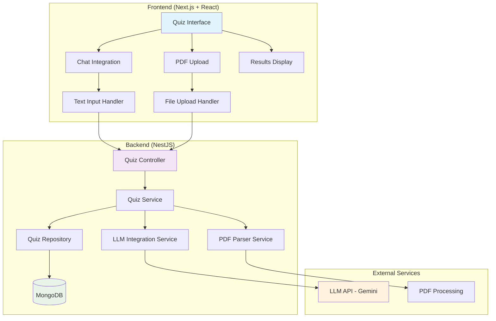

# AI Quiz Generator Design Document

## Overview

The AI Quiz Generator is a comprehensive testing module that integrates with the existing SmartStudy platform to provide adaptive, AI-powered quiz generation and assessment capabilities. The system leverages Large Language Models (LLMs) to create personalized quizzes from user-provided content, ensuring secure answer validation and providing detailed corrective feedback.

The feature builds upon the existing NestJS backend and Next.js frontend architecture, utilizing MongoDB for data persistence and integrating seamlessly with the current authentication and user management systems.

## Architecture

### High-Level Architecture



### System Components

1. **Frontend Components**
   - Quiz Generation Interface
   - Quiz Taking Interface  
   - Results Display Interface
   - PDF Upload Component
   - Chat Integration Component

2. **Backend Services**
   - Quiz Management Service
   - LLM Integration Service
   - PDF Processing Service
   - Quiz Validation Service

3. **Data Layer**
   - Quiz Schema
   - Quiz Attempt Schema
   - User Performance Schema

## Components and Interfaces

### Frontend Components

#### 1. Quiz Generation Interface (`/components/quiz/QuizGenerator.tsx`)

```typescript
interface QuizGeneratorProps {
  onQuizGenerated: (quizId: string) => void;
  initialTopic?: string;
}

interface QuizGenerationState {
  inputMethod: 'text' | 'pdf';
  textInput: string;
  uploadedFile: File | null;
  isGenerating: boolean;
  error: string | null;
}
```

**Key Features:**
- Toggle between text input and PDF upload
- Real-time validation of input content
- Loading states during generation
- Error handling and user feedback

#### 2. Quiz Taking Interface (`/components/quiz/QuizTaker.tsx`)

```typescript
interface QuizTakerProps {
  quizId: string;
  onSubmit: (answers: QuizAnswers) => void;
}

interface QuizData {
  id: string;
  questions: Question[];
  timeLimit?: number;
  topic: string;
}

interface Question {
  id: string;
  text: string;
  options: string[];
}

interface QuizAnswers {
  [questionId: string]: string;
}
```

**Key Features:**
- Clean, distraction-free interface
- Progress tracking
- Answer persistence during navigation
- Submit validation

#### 3. Results Display Interface (`/components/quiz/QuizResults.tsx`)

```typescript
interface QuizResultsProps {
  quizId: string;
  attemptId: string;
}

interface QuizResult {
  score: number;
  totalQuestions: number;
  percentage: number;
  questionResults: QuestionResult[];
  completedAt: Date;
}

interface QuestionResult {
  question: string;
  userAnswer: string;
  correctAnswer: string;
  isCorrect: boolean;
  explanation?: string;
}
```

**Key Features:**
- Color-coded results (green for correct, red for incorrect)
- Detailed breakdown per question
- Performance insights
- Retake options

### Backend Services

#### 1. Quiz Module (`/modules/quiz/`)

**Quiz Controller (`quiz.controller.ts`)**
```typescript
@Controller('quiz')
export class QuizController {
  @Post('generate')
  async generateQuiz(@Body() generateQuizDto: GenerateQuizDto): Promise<QuizResponse>
  
  @Get(':id')
  async getQuiz(@Param('id') id: string): Promise<QuizData>
  
  @Post(':id/submit')
  async submitQuiz(@Param('id') id: string, @Body() answers: SubmitQuizDto): Promise<QuizResult>
  
  @Get('user/:userId/history')
  async getUserQuizHistory(@Param('userId') userId: string): Promise<QuizHistory[]>
}
```

**Quiz Service (`quiz.service.ts`)**
```typescript
@Injectable()
export class QuizService {
  async generateQuizFromText(text: string, userId: string): Promise<Quiz>
  async generateQuizFromPdf(file: Buffer, userId: string): Promise<Quiz>
  async getQuizForUser(quizId: string, userId: string): Promise<QuizData>
  async submitQuizAnswers(quizId: string, userId: string, answers: QuizAnswers): Promise<QuizResult>
  async getUserPerformanceHistory(userId: string): Promise<QuizHistory[]>
}
```

#### 2. LLM Integration Service (`/services/llm.service.ts`)

```typescript
@Injectable()
export class LLMService {
  async generateQuizQuestions(content: string): Promise<GeneratedQuiz>
  private buildPrompt(content: string): string
  private validateLLMResponse(response: any): boolean
  private retryGeneration(content: string, attempts: number): Promise<GeneratedQuiz>
}

interface GeneratedQuiz {
  questions: {
    question: string;
    options: string[];
    correctAnswer: string;
    explanation?: string;
  }[];
}
```

**LLM Prompt Structure:**
```
You are an educational quiz generator. Generate exactly 5 multiple-choice questions based on the following content.

Content: {user_content}

Requirements:
1. Generate exactly 5 questions
2. Each question must have exactly 4 options (A, B, C, D)
3. Only one option should be correct
4. Questions should test understanding, not just memorization
5. Include brief explanations for correct answers

Return your response in the following JSON format:
{
  "questions": [
    {
      "question": "Question text here?",
      "options": ["Option A", "Option B", "Option C", "Option D"],
      "correctAnswer": "Option A",
      "explanation": "Brief explanation of why this is correct"
    }
  ]
}
```

#### 3. PDF Processing Service (`/services/pdf.service.ts`)

```typescript
@Injectable()
export class PDFService {
  async extractTextFromPDF(buffer: Buffer): Promise<string>
  private validatePDFContent(text: string): boolean
  private cleanExtractedText(text: string): string
}
```

## Data Models

### Quiz Schema (`/schemas/quiz.schema.ts`)

```typescript
@Schema({ timestamps: true })
export class Quiz {
  @Prop({ required: true })
  topic: string;

  @Prop({ required: true, type: mongoose.Schema.Types.ObjectId, ref: 'User' })
  createdBy: string;

  @Prop({ required: true })
  questions: QuizQuestion[];

  @Prop({ required: true })
  correctAnswers: string[]; // Stored securely, not sent to frontend

  @Prop({ default: 'active' })
  status: 'active' | 'archived';

  @Prop()
  sourceContent: string; // Original content used for generation

  @Prop({ default: Date.now })
  createdAt: Date;
}

interface QuizQuestion {
  id: string;
  question: string;
  options: string[];
}
```

### Quiz Attempt Schema (`/schemas/quiz-attempt.schema.ts`)

```typescript
@Schema({ timestamps: true })
export class QuizAttempt {
  @Prop({ required: true, type: mongoose.Schema.Types.ObjectId, ref: 'Quiz' })
  quizId: string;

  @Prop({ required: true, type: mongoose.Schema.Types.ObjectId, ref: 'User' })
  userId: string;

  @Prop({ required: true })
  userAnswers: { [questionId: string]: string };

  @Prop({ required: true })
  score: number;

  @Prop({ required: true })
  totalQuestions: number;

  @Prop({ required: true })
  percentage: number;

  @Prop({ required: true })
  questionResults: QuestionResult[];

  @Prop({ default: Date.now })
  completedAt: Date;
}

interface QuestionResult {
  questionId: string;
  question: string;
  userAnswer: string;
  correctAnswer: string;
  isCorrect: boolean;
  explanation?: string;
}
```

### User Performance Schema (`/schemas/user-performance.schema.ts`)

```typescript
@Schema({ timestamps: true })
export class UserPerformance {
  @Prop({ required: true, type: mongoose.Schema.Types.ObjectId, ref: 'User' })
  userId: string;

  @Prop({ required: true })
  totalQuizzes: number;

  @Prop({ required: true })
  averageScore: number;

  @Prop({ required: true })
  topicPerformance: { [topic: string]: TopicStats };

  @Prop({ default: Date.now })
  lastUpdated: Date;
}

interface TopicStats {
  quizzesTaken: number;
  averageScore: number;
  bestScore: number;
  improvementTrend: number;
}
```

## Error Handling

### Frontend Error Handling

1. **Network Errors**
   - Retry mechanisms for failed requests
   - Offline state detection and queuing
   - User-friendly error messages

2. **Validation Errors**
   - Real-time input validation
   - Clear error messaging
   - Guided error resolution

3. **LLM Service Errors**
   - Fallback to cached quizzes
   - Alternative generation methods
   - Graceful degradation

### Backend Error Handling

1. **LLM Integration Errors**
   ```typescript
   try {
     const quiz = await this.llmService.generateQuiz(content);
     return quiz;
   } catch (error) {
     if (error instanceof LLMServiceUnavailableError) {
       throw new ServiceUnavailableException('Quiz generation temporarily unavailable');
     }
     throw new InternalServerErrorException('Failed to generate quiz');
   }
   ```

2. **PDF Processing Errors**
   ```typescript
   try {
     const text = await this.pdfService.extractText(buffer);
     if (!this.pdfService.validateContent(text)) {
       throw new BadRequestException('PDF content insufficient for quiz generation');
     }
     return text;
   } catch (error) {
     throw new BadRequestException('Unable to process PDF file');
   }
   ```

3. **Database Errors**
   - Connection retry logic
   - Transaction rollback mechanisms
   - Data consistency validation

## Testing Strategy

### Unit Testing

1. **Frontend Components**
   - Component rendering tests
   - User interaction tests
   - State management tests
   - Error boundary tests

2. **Backend Services**
   - Service method tests
   - Data validation tests
   - Error handling tests
   - Integration tests with mocked dependencies

### Integration Testing

1. **API Endpoint Tests**
   - Request/response validation
   - Authentication and authorization
   - Error response handling
   - Performance benchmarks

2. **Database Integration Tests**
   - Schema validation
   - Query performance
   - Data integrity tests
   - Migration tests

3. **External Service Integration Tests**
   - LLM API integration
   - PDF processing pipeline
   - Error handling and fallbacks

### End-to-End Testing

1. **Quiz Generation Flow**
   - Text input to quiz generation
   - PDF upload to quiz generation
   - Error scenarios and recovery

2. **Quiz Taking Flow**
   - Complete quiz workflow
   - Answer submission and validation
   - Results display and accuracy

3. **Performance Testing**
   - Concurrent user scenarios
   - Large file processing
   - Database performance under load

### Security Testing

1. **Input Validation**
   - Malicious content filtering
   - File upload security
   - SQL injection prevention

2. **Authentication & Authorization**
   - User access control
   - Quiz ownership validation
   - Session management

3. **Data Protection**
   - Answer security (no client-side exposure)
   - User data privacy
   - Secure data transmission

## Performance Considerations

### Frontend Optimization

1. **Code Splitting**
   - Lazy loading of quiz components
   - Dynamic imports for PDF processing
   - Route-based code splitting

2. **State Management**
   - Efficient state updates
   - Memoization of expensive calculations
   - Optimistic UI updates

3. **Asset Optimization**
   - Image optimization for quiz interfaces
   - Bundle size optimization
   - Progressive loading strategies

### Backend Optimization

1. **Database Optimization**
   - Proper indexing strategies
   - Query optimization
   - Connection pooling

2. **Caching Strategy**
   - Redis caching for frequently accessed quizzes
   - LLM response caching
   - User performance data caching

3. **API Performance**
   - Request/response compression
   - Pagination for large datasets
   - Rate limiting and throttling

### Scalability Considerations

1. **Horizontal Scaling**
   - Stateless service design
   - Load balancer configuration
   - Database sharding strategies

2. **Resource Management**
   - Memory usage optimization
   - CPU-intensive task queuing
   - File storage optimization

## Security Implementation

### Data Security

1. **Answer Protection**
   - Correct answers never sent to frontend
   - Server-side validation only
   - Encrypted storage of sensitive data

2. **User Data Protection**
   - GDPR compliance measures
   - Data anonymization options
   - Secure data deletion

### API Security

1. **Authentication & Authorization**
   - JWT token validation
   - Role-based access control
   - Quiz ownership verification

2. **Input Validation**
   - Content sanitization
   - File type validation
   - Size limit enforcement

3. **Rate Limiting**
   - Quiz generation limits
   - API request throttling
   - Abuse prevention mechanisms