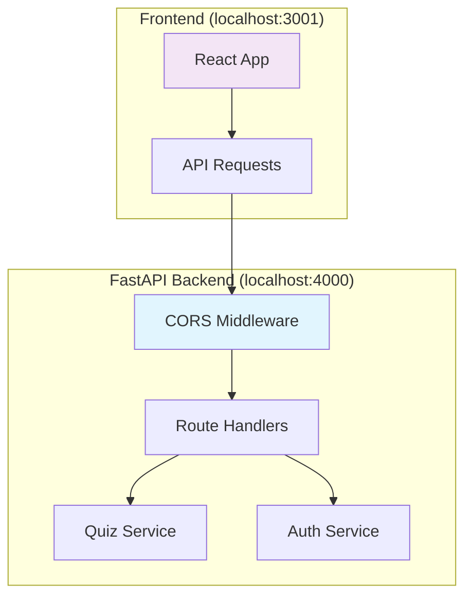

# CORS Configuration Design Document

## Overview

This design document outlines the implementation of Cross-Origin Resource Sharing (CORS) configuration for the FastAPI backend to enable secure communication with the React frontend. The solution addresses the immediate blocking issue while providing a flexible, environment-aware configuration system.

## Architecture

### CORS Middleware Integration



### Configuration Strategy

The CORS configuration will be implemented using FastAPI's built-in CORS middleware with environment-specific settings:

1. **Development Environment**: Permissive settings for localhost development
2. **Production Environment**: Restrictive settings for security
3. **Environment Variables**: Override defaults for custom deployments

## Components and Interfaces

### 1. CORS Configuration Module (`app/config/cors.py`)

```python
from fastapi.middleware.cors import CORSMiddleware
from typing import List
import os

class CORSConfig:
    def __init__(self):
        self.allowed_origins = self._get_allowed_origins()
        self.allowed_methods = ["GET", "POST", "PUT", "PATCH", "DELETE", "OPTIONS"]
        self.allowed_headers = [
            "Content-Type", 
            "Authorization", 
            "Accept", 
            "Origin", 
            "X-Requested-With"
        ]
        self.allow_credentials = True
        self.expose_headers = ["*"]
    
    def _get_allowed_origins(self) -> List[str]:
        # Environment-specific configuration
        env = os.getenv("ENVIRONMENT", "development")
        
        if env == "development":
            return [
                "http://localhost:3000",
                "http://localhost:3001", 
                "http://127.0.0.1:3000",
                "http://127.0.0.1:3001"
            ]
        elif env == "production":
            # Production domains from environment variables
            origins = os.getenv("ALLOWED_ORIGINS", "").split(",")
            return [origin.strip() for origin in origins if origin.strip()]
        else:
            # Custom environment
            custom_origins = os.getenv("CORS_ORIGINS", "")
            if custom_origins:
                return [origin.strip() for origin in custom_origins.split(",")]
            return ["http://localhost:3001"]  # Safe default

def get_cors_config() -> CORSConfig:
    return CORSConfig()
```

### 2. Main Application Integration (`app/main.py`)

```python
from fastapi import FastAPI
from fastapi.middleware.cors import CORSMiddleware
from app.config.cors import get_cors_config
import logging

def create_app() -> FastAPI:
    app = FastAPI(title="SmartStudy API")
    
    # CORS Configuration
    cors_config = get_cors_config()
    
    app.add_middleware(
        CORSMiddleware,
        allow_origins=cors_config.allowed_origins,
        allow_credentials=cors_config.allow_credentials,
        allow_methods=cors_config.allowed_methods,
        allow_headers=cors_config.allowed_headers,
        expose_headers=cors_config.expose_headers,
    )
    
    # Log CORS configuration for debugging
    logging.info(f"CORS configured with origins: {cors_config.allowed_origins}")
    
    return app
```

### 3. Environment Configuration

#### Development (.env.development)
```env
ENVIRONMENT=development
CORS_DEBUG=true
```

#### Production (.env.production)
```env
ENVIRONMENT=production
ALLOWED_ORIGINS=https://smartstudy.com,https://app.smartstudy.com
CORS_DEBUG=false
```

## Error Handling

### CORS Error Logging

```python
import logging
from fastapi import Request, Response
from fastapi.middleware.base import BaseHTTPMiddleware

class CORSLoggingMiddleware(BaseHTTPMiddleware):
    async def dispatch(self, request: Request, call_next):
        # Log incoming request details
        origin = request.headers.get("origin")
        method = request.method
        
        if origin:
            logging.info(f"CORS request: {method} from {origin}")
        
        response = await call_next(request)
        
        # Log CORS headers in response
        cors_headers = {
            key: value for key, value in response.headers.items() 
            if key.lower().startswith("access-control-")
        }
        
        if cors_headers:
            logging.debug(f"CORS response headers: {cors_headers}")
        
        return response
```

### Preflight Request Handling

FastAPI's CORSMiddleware automatically handles OPTIONS preflight requests, but we can add custom logging:

```python
from fastapi import FastAPI, Request
from fastapi.responses import Response

@app.options("/{path:path}")
async def handle_options(request: Request, path: str):
    """Custom OPTIONS handler for debugging"""
    origin = request.headers.get("origin", "unknown")
    logging.info(f"Preflight request for {path} from {origin}")
    
    # Let CORSMiddleware handle the actual response
    return Response(status_code=200)
```

## Security Considerations

### 1. Origin Validation

```python
def validate_origin(origin: str) -> bool:
    """Validate if origin is allowed"""
    allowed_patterns = [
        r"^https?://localhost:\d+$",  # Development
        r"^https://.*\.smartstudy\.com$",  # Production subdomains
        r"^https://smartstudy\.com$"  # Main domain
    ]
    
    import re
    return any(re.match(pattern, origin) for pattern in allowed_patterns)
```

### 2. Credential Handling

```python
# Only allow credentials for trusted origins
def should_allow_credentials(origin: str) -> bool:
    trusted_origins = [
        "https://smartstudy.com",
        "https://app.smartstudy.com"
    ]
    return origin in trusted_origins or origin.startswith("http://localhost:")
```

### 3. Header Restrictions

```python
# Limit exposed headers in production
def get_expose_headers(environment: str) -> List[str]:
    if environment == "production":
        return ["Content-Type", "Authorization"]
    else:
        return ["*"]  # More permissive for development
```

## Testing Strategy

### 1. Unit Tests for CORS Configuration

```python
import pytest
from app.config.cors import CORSConfig
import os

def test_development_origins():
    os.environ["ENVIRONMENT"] = "development"
    config = CORSConfig()
    assert "http://localhost:3001" in config.allowed_origins

def test_production_origins():
    os.environ["ENVIRONMENT"] = "production"
    os.environ["ALLOWED_ORIGINS"] = "https://example.com,https://app.example.com"
    config = CORSConfig()
    assert "https://example.com" in config.allowed_origins
    assert "http://localhost:3001" not in config.allowed_origins
```

### 2. Integration Tests

```python
from fastapi.testclient import TestClient
from app.main import create_app

def test_cors_preflight():
    app = create_app()
    client = TestClient(app)
    
    response = client.options(
        "/quiz/generate-from-pdf",
        headers={
            "Origin": "http://localhost:3001",
            "Access-Control-Request-Method": "POST",
            "Access-Control-Request-Headers": "Content-Type"
        }
    )
    
    assert response.status_code == 200
    assert "access-control-allow-origin" in response.headers
    assert response.headers["access-control-allow-origin"] == "http://localhost:3001"

def test_cors_actual_request():
    app = create_app()
    client = TestClient(app)
    
    response = client.post(
        "/quiz/generate-from-pdf",
        headers={"Origin": "http://localhost:3001"},
        files={"file": ("test.pdf", b"test content", "application/pdf")}
    )
    
    assert "access-control-allow-origin" in response.headers
```

## Performance Considerations

### 1. Middleware Ordering

```python
# CORS middleware should be added early in the middleware stack
app.add_middleware(CORSMiddleware, ...)  # First
app.add_middleware(AuthenticationMiddleware, ...)  # After CORS
app.add_middleware(LoggingMiddleware, ...)  # Last
```

### 2. Caching CORS Responses

```python
# Add cache headers for preflight responses
@app.middleware("http")
async def add_cors_cache_headers(request: Request, call_next):
    response = await call_next(request)
    
    if request.method == "OPTIONS":
        response.headers["Access-Control-Max-Age"] = "86400"  # 24 hours
    
    return response
```

## Monitoring and Debugging

### 1. CORS Request Logging

```python
import logging

# Configure CORS-specific logger
cors_logger = logging.getLogger("cors")
cors_logger.setLevel(logging.INFO)

def log_cors_request(request: Request, response: Response):
    origin = request.headers.get("origin")
    if origin:
        cors_logger.info(
            f"CORS {request.method} {request.url.path} "
            f"from {origin} -> {response.status_code}"
        )
```

### 2. Health Check Endpoint

```python
@app.get("/health/cors")
async def cors_health_check():
    """Endpoint to verify CORS configuration"""
    config = get_cors_config()
    return {
        "cors_enabled": True,
        "allowed_origins_count": len(config.allowed_origins),
        "environment": os.getenv("ENVIRONMENT", "development"),
        "allow_credentials": config.allow_credentials
    }
```

## Deployment Configuration

### Docker Environment Variables

```dockerfile
# Dockerfile
ENV ENVIRONMENT=production
ENV ALLOWED_ORIGINS=https://smartstudy.com,https://app.smartstudy.com
ENV CORS_DEBUG=false
```

### Kubernetes ConfigMap

```yaml
apiVersion: v1
kind: ConfigMap
metadata:
  name: cors-config
data:
  ENVIRONMENT: "production"
  ALLOWED_ORIGINS: "https://smartstudy.com,https://app.smartstudy.com"
  CORS_DEBUG: "false"
```

This design provides a comprehensive, secure, and maintainable CORS configuration that addresses the immediate frontend-backend communication issue while supporting different deployment environments.