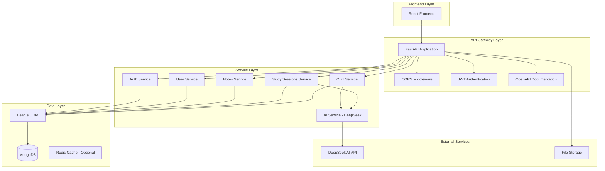
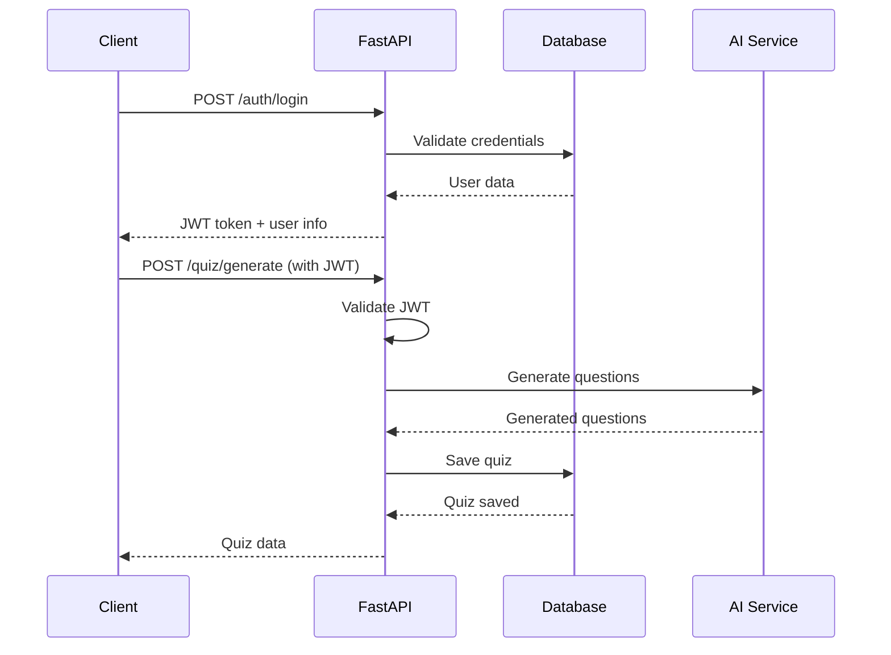

# FastAPI Backend Migration Design

## Overview

This design document outlines the architecture and implementation strategy for migrating the SmartStudy backend from NestJS (TypeScript) to FastAPI (Python). The migration will maintain full API compatibility while enhancing AI integration capabilities and improving performance for AI-powered features.

The current NestJS backend consists of 5 main modules: Auth, Users, Notes, Study Sessions, and Quiz. Each module will be migrated to FastAPI with equivalent functionality, improved AI integration, and enhanced performance.

## Architecture

### High-Level Architecture



### Technology Stack Migration

| Component | NestJS (Current) | FastAPI (Target) | Rationale |
|-----------|------------------|------------------|-----------|
| Framework | NestJS | FastAPI | Better async performance, native Python AI integration |
| Language | TypeScript | Python | Unified language for AI/ML operations |
| Database ORM | Mongoose | Beanie (async) | Async MongoDB operations, Pydantic integration |
| Authentication | JWT + Passport | JWT + python-jose | Maintain token compatibility |
| Validation | class-validator | Pydantic | Built-in FastAPI validation |
| Documentation | Swagger (manual) | OpenAPI (automatic) | Auto-generated comprehensive docs |
| AI Integration | HTTP requests | Native Python libraries | Better performance and integration |

## Components and Interfaces

### 1. Application Structure

```
smartstudy/fastapi-backend/
├── app/
│   ├── __init__.py
│   ├── main.py                 # FastAPI application entry point
│   ├── config.py              # Configuration management
│   ├── database.py            # Database connection and initialization
│   ├── dependencies.py        # Dependency injection (auth, etc.)
│   ├── models/                # Pydantic models and Beanie documents
│   │   ├── __init__.py
│   │   ├── user.py           # User model and schemas
│   │   ├── note.py           # Note model and schemas
│   │   ├── quiz.py           # Quiz model and schemas
│   │   ├── study_session.py  # Study session model and schemas
│   │   └── analytics.py      # Analytics and stats models
│   ├── routers/              # API route handlers
│   │   ├── __init__.py
│   │   ├── auth.py           # Authentication endpoints
│   │   ├── users.py          # User management endpoints
│   │   ├── notes.py          # Notes CRUD endpoints
│   │   ├── quiz.py           # Quiz generation and management
│   │   ├── study_sessions.py # Study session tracking
│   │   └── analytics.py      # Analytics and reporting
│   ├── services/             # Business logic services
│   │   ├── __init__.py
│   │   ├── auth_service.py   # Authentication logic
│   │   ├── deepseek_ai.py    # AI service integration
│   │   ├── quiz_service.py   # Quiz business logic
│   │   └── analytics_service.py # Analytics calculations
│   └── utils/                # Utility functions
│       ├── __init__.py
│       ├── security.py       # Password hashing, JWT handling
│       ├── pdf_parser.py     # PDF text extraction
│       └── validators.py     # Custom validation functions
├── requirements.txt          # Python dependencies
├── .env.example             # Environment variables template
└── Dockerfile              # Container configuration
```

### 2. Data Models Migration

#### User Model Migration
```python
# NestJS Schema -> FastAPI Beanie Document
class User(Document):
    # Core fields (maintain compatibility)
    email: Indexed(EmailStr, unique=True)
    name: str  # Maps to NestJS 'name' field
    hashed_password: str  # Maps to NestJS 'password' field
    
    # Enhanced fields (new in FastAPI)
    username: Indexed(str, unique=True)  # Optional, fallback to email
    full_name: str  # Enhanced from 'name'
    role: UserRole = UserRole.STUDENT
    is_active: bool = True
    
    # Study tracking (enhanced)
    total_study_time: int = 0
    quizzes_completed: int = 0
    average_quiz_score: float = 0.0
    study_streak: int = 0
    
    # Timestamps (maintain compatibility)
    created_at: datetime = Field(default_factory=datetime.utcnow)
    updated_at: datetime = Field(default_factory=datetime.utcnow)
```

#### Quiz Model Migration
```python
# Enhanced quiz model with better AI integration
class Quiz(Document):
    # Core fields (maintain compatibility)
    topic: str
    created_by: Link[User]  # Maps to NestJS createdBy
    questions: List[Question]  # Enhanced structure
    status: QuizStatus = QuizStatus.ACTIVE  # Maps to NestJS status
    source_content: Optional[str]  # Maps to NestJS sourceContent
    
    # Enhanced fields
    title: str  # New field for better organization
    description: Optional[str]
    difficulty: DifficultyLevel = DifficultyLevel.MEDIUM
    is_ai_generated: bool = False
    
    # Settings
    time_limit: Optional[int] = None
    max_attempts: int = 3
    show_correct_answers: bool = True
    
    # Statistics
    total_attempts: int = 0
    average_score: float = 0.0
    
    # Timestamps (maintain compatibility)
    created_at: datetime = Field(default_factory=datetime.utcnow)
    updated_at: datetime = Field(default_factory=datetime.utcnow)
```

### 3. API Endpoint Migration

#### Authentication Endpoints
```python
# Maintain exact compatibility with NestJS endpoints
POST /auth/register     # RegisterDto -> UserCreate
POST /auth/login        # LoginDto -> OAuth2PasswordRequestForm
POST /auth/logout       # Clear JWT cookie
GET  /auth/me          # Get current user (new endpoint)
POST /auth/refresh     # Refresh JWT token (new endpoint)
```

#### Quiz Endpoints
```python
# Enhanced quiz endpoints with AI integration
POST /quiz/generate              # Generate quiz from text/PDF
POST /quiz/generate-from-pdf     # Dedicated PDF endpoint
GET  /quiz/                      # List user quizzes
GET  /quiz/{quiz_id}            # Get specific quiz
POST /quiz/attempt              # Start quiz attempt
POST /quiz/submit               # Submit quiz answers
GET  /quiz/attempts/{quiz_id}   # Get quiz attempts
DELETE /quiz/{quiz_id}          # Delete quiz
```

### 4. AI Service Integration

#### DeepSeek AI Service Architecture
```python
class DeepSeekAIService:
    """Enhanced AI service with better error handling and caching"""
    
    async def generate_quiz_questions(
        self,
        content: str,
        topic: Optional[str] = None,
        difficulty: DifficultyLevel = DifficultyLevel.MEDIUM,
        question_count: int = 5,
        question_types: List[QuestionType] = None
    ) -> List[Question]:
        """Generate quiz questions with fallback mechanisms"""
        
    async def generate_study_plan(
        self,
        subjects: List[Dict[str, Any]],
        daily_hours: int,
        exam_date: str,
        goals: str = ""
    ) -> Dict[str, Any]:
        """Generate intelligent study plans"""
        
    async def analyze_performance(
        self,
        quiz_attempts: List[QuizAttempt],
        study_sessions: List[StudySession]
    ) -> Dict[str, Any]:
        """Analyze user performance and provide recommendations"""
```

## Data Models

### Database Schema Compatibility

The FastAPI backend will maintain full compatibility with existing MongoDB collections:

1. **Users Collection**: Maps directly with enhanced fields
2. **Quizzes Collection**: Compatible structure with additional metadata
3. **Notes Collection**: Direct mapping with enhanced search capabilities
4. **Study Sessions Collection**: Compatible with additional analytics fields
5. **Quiz Attempts Collection**: New collection for better quiz tracking

### Migration Strategy

```python
# Database migration utilities
class DataMigration:
    async def migrate_users(self):
        """Migrate user documents to new schema"""
        # Add username field (fallback to email)
        # Add enhanced tracking fields
        # Maintain password compatibility
        
    async def migrate_quizzes(self):
        """Migrate quiz documents to enhanced schema"""
        # Add title field (from topic)
        # Restructure questions with IDs
        # Add difficulty and settings
        
    async def validate_migration(self):
        """Validate data integrity after migration"""
        # Check all documents are accessible
        # Verify relationships are intact
        # Test API compatibility
```

## Error Handling

### Comprehensive Error Management

```python
# Custom exception handlers
class SmartStudyException(HTTPException):
    """Base exception for SmartStudy application"""
    
class AuthenticationError(SmartStudyException):
    """Authentication related errors"""
    
class QuizGenerationError(SmartStudyException):
    """Quiz generation failures"""
    
class AIServiceError(SmartStudyException):
    """AI service integration errors"""

# Global error handlers
@app.exception_handler(SmartStudyException)
async def smartstudy_exception_handler(request: Request, exc: SmartStudyException):
    return JSONResponse(
        status_code=exc.status_code,
        content={
            "error": exc.detail,
            "type": exc.__class__.__name__,
            "timestamp": datetime.utcnow().isoformat()
        }
    )
```

### Fallback Mechanisms

1. **AI Service Fallbacks**: When DeepSeek API fails, use local question generation
2. **Database Fallbacks**: Graceful degradation for database connectivity issues
3. **Authentication Fallbacks**: Maintain session state during service interruptions

## Testing Strategy

### Test Coverage Plan

1. **Unit Tests**: Individual service and utility function testing
2. **Integration Tests**: API endpoint testing with test database
3. **Migration Tests**: Data migration validation and rollback testing
4. **Performance Tests**: Load testing and benchmark comparisons
5. **Compatibility Tests**: Frontend integration testing

### Test Structure

```python
# Test organization
tests/
├── unit/
│   ├── test_auth_service.py
│   ├── test_quiz_service.py
│   ├── test_ai_service.py
│   └── test_models.py
├── integration/
│   ├── test_auth_endpoints.py
│   ├── test_quiz_endpoints.py
│   └── test_database.py
├── migration/
│   ├── test_data_migration.py
│   └── test_compatibility.py
└── performance/
    ├── test_load.py
    └── test_benchmarks.py
```

### Migration Testing Protocol

1. **Pre-migration**: Backup existing data and test current functionality
2. **Migration**: Run migration scripts with validation checkpoints
3. **Post-migration**: Comprehensive testing of all endpoints and features
4. **Rollback**: Tested rollback procedures for migration failures

## Performance Considerations

### Optimization Strategies

1. **Async Operations**: Full async/await implementation for database and AI operations
2. **Connection Pooling**: Optimized MongoDB connection management
3. **Caching**: Redis integration for frequently accessed data
4. **AI Response Caching**: Cache AI-generated content to reduce API calls
5. **Database Indexing**: Optimized indexes for common query patterns

### Monitoring and Metrics

```python
# Performance monitoring
class PerformanceMonitor:
    async def track_request_time(self, endpoint: str, duration: float):
        """Track API response times"""
        
    async def track_ai_usage(self, operation: str, tokens_used: int):
        """Monitor AI service usage"""
        
    async def track_database_performance(self, query_type: str, duration: float):
        """Monitor database query performance"""
```

## Security Enhancements

### Security Improvements

1. **Enhanced JWT Handling**: Improved token validation and refresh mechanisms
2. **Rate Limiting**: API rate limiting to prevent abuse
3. **Input Validation**: Comprehensive Pydantic validation for all inputs
4. **CORS Configuration**: Proper CORS setup for frontend integration
5. **Environment Security**: Secure handling of environment variables and secrets

### Authentication Flow



This design ensures a smooth migration from NestJS to FastAPI while maintaining full compatibility and enhancing AI integration capabilities. The modular architecture allows for incremental migration and testing, minimizing risks during the transition.